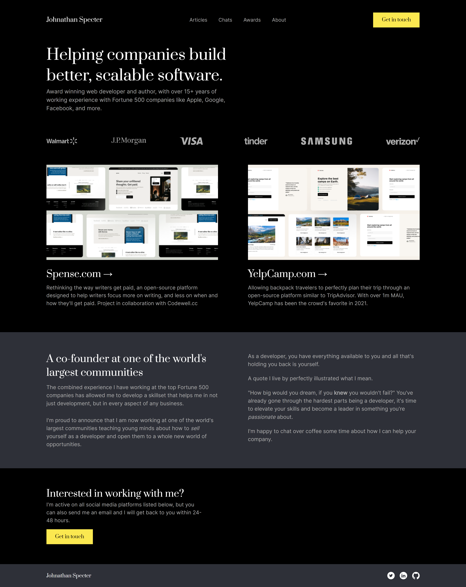

# Codewell - Developer Portfolio

This is a solution to the [Developer Portfolio Challenge](https://www.codewell.cc/challenges/web-developer-portfolio--617d4897a383e41090a3e46f)

## Table of contents

- [Codewell - Developer Portfolio](#codewell---developer-portfolio)
  - [Table of contents](#table-of-contents)
  - [Overview](#overview)
    - [Screenshot](#screenshot)
    - [Links](#links)
  - [My process](#my-process)
    - [Built with](#built-with)
    - [What I learned](#what-i-learned)
    - [Fonts Used](#fonts-used)

## Overview

### Screenshot

### Links

- Solution URL: [https://github.com/ShrutiShinde418/Codewell/tree/main/developer-portfolio](https://github.com/ShrutiShinde418/Codewell/tree/main/developer-portfolio)
- Live Site URL: [https://developer-portfolio-k9la4up1h-shrutishinde418.vercel.app/](https://developer-portfolio-k9la4up1h-shrutishinde418.vercel.app/)

## My process

### Built with

- Tailwind CSS

### What I learned

- Tailwind CSS
- How to make a hamburger menu

### Fonts Used

For headings: https://fonts.google.com/specimen/Prata
For body: https://fonts.google.com/specimen/Inter

