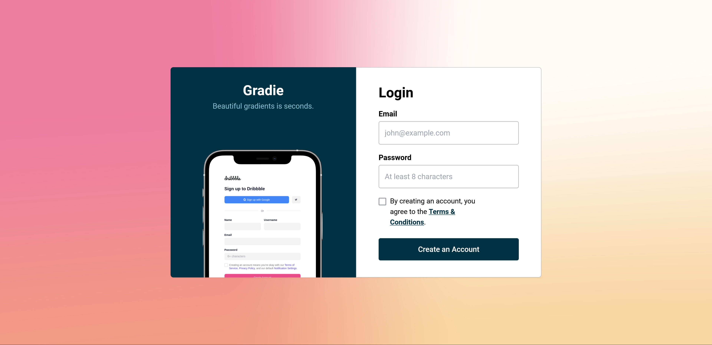

# Codewell - Gradie Signup page solution

This is a solution to the Gradie signup page on Codewell.

## Table of contents

- [Codewell - Gradie Signup page solution](#codewell---gradie-signup-page-solution)
  - [Table of contents](#table-of-contents)
  - [Overview](#overview)
    - [Screenshot](#screenshot)
    - [Links](#links)
    - [Fonts Used](#fonts-used)
  - [My process](#my-process)
    - [Built with](#built-with)

## Overview

### Screenshot

### Links

- Solution URL: [https://github.com/ShrutiShinde418/Codewell/tree/main/gradie-signup](https://github.com/ShrutiShinde418/Codewell/tree/main/gradie-signup)
- Live Site URL: [https://gradie-signup-j6ppgn0hv-shrutishinde418.vercel.app/](https://gradie-signup-j6ppgn0hv-shrutishinde418.vercel.app/)

### Fonts Used

https://fonts.google.com/specimen/Roboto

## My process

### Built with

- Tailwind CSS

