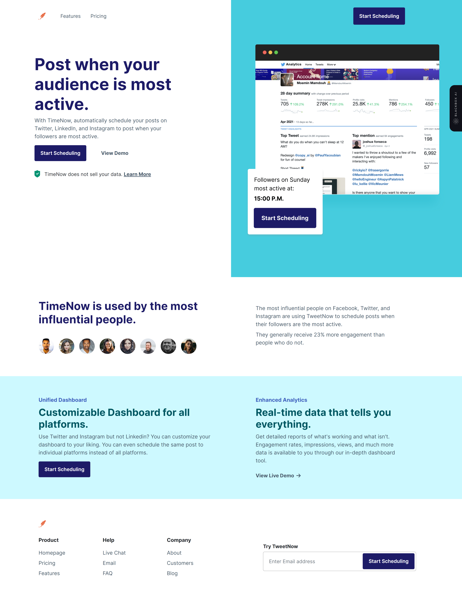
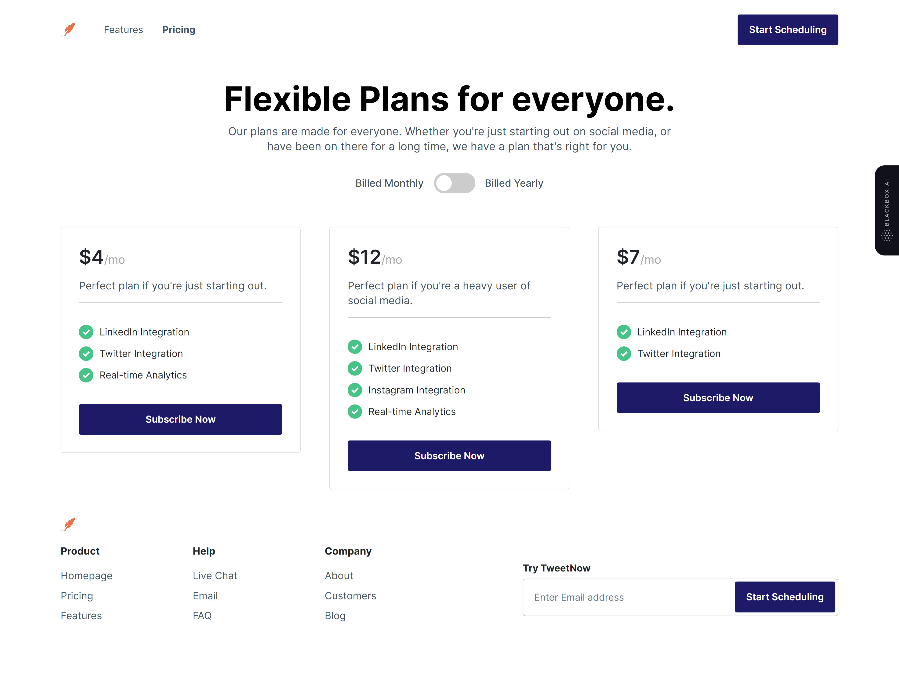

# Codewell - TimeNow Solution

## Table of contents

- [Codewell - TimeNow Solution](#codewell---timenow-solution)
  - [Table of contents](#table-of-contents)
  - [Overview](#overview)
    - [Screenshot](#screenshot)
    - [Links](#links)
  - [My process](#my-process)
    - [Built with](#built-with)
    - [What I learned](#what-i-learned)
  - [Contact](#contact)

## Overview

### Screenshot

### Links

- Solution URL: [https://github.com/ShrutiShinde418/Codewell/tree/main/time-now](https://github.com/ShrutiShinde418/Codewell/tree/main/time-now)
- Live Site URL: [https://time-now-landing.vercel.app/](https://time-now-landing.vercel.app/)

## My process

### Built with

- Semantic HTML5 markup
- Bootstrap 5.1

### What I learned

- Positioning using position: absolute and position: relative;.

## Contact

- GitHub [@ShrutiShinde418](https://github.com/ShrutiShinde418)

